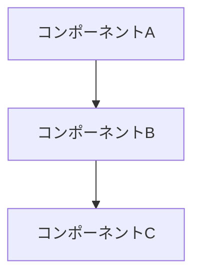
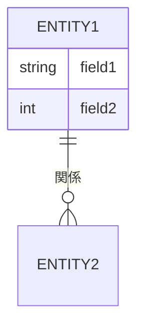
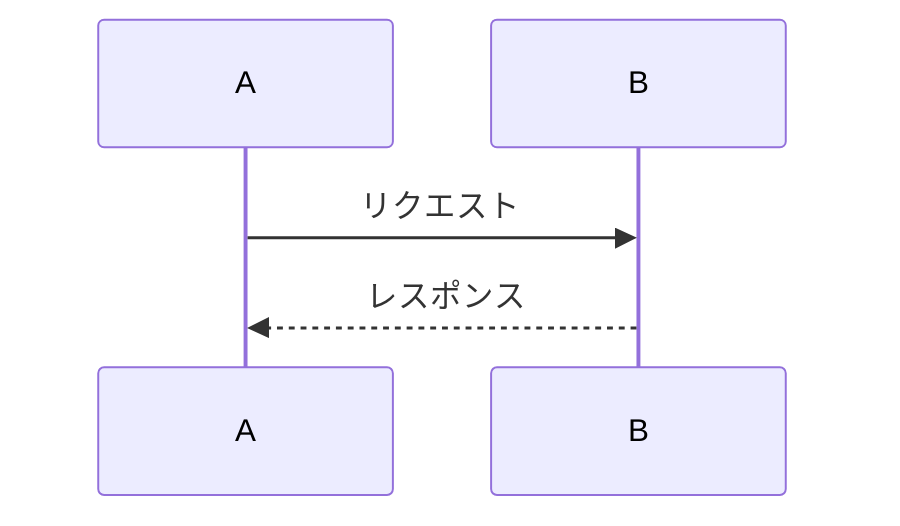

# Design ドキュメント作成

現在の作業コンテキストに基づき、アーキテクチャ・設計ドキュメントを作成する。
`/doc` から委譲された場合も、直接呼び出された場合もこのファイルの手順に従う。

## ステップ1: ディレクトリ準備

```bash
# 配置先ディレクトリの存在確認。なければ作成する
ls docs/30_design/ 2>/dev/null || mkdir -p docs/30_design/

# 既存の設計ドキュメントを確認
ls docs/30_design/
```

## ステップ2: Design ドキュメントの作成

以下の品質原則を制約として守りながら作成する。

| 原則 | 内容 |
|------|------|
| Single Purpose | アーキテクチャ・データモデル・インターフェース設計・シーケンスのみを記述する |
| ADR-Based Decisions | 設計上の重要な選択は対応する ADR が存在するか確認する |
| Single Source of Truth | 既存設計ドキュメントと重複しない |
| Template-Driven Creation | 以下のテンプレートに沿って作成し、実際の内容で埋める |
| シークレット不在 | 環境変数・パスワード・トークン等をリポジトリに記載しない |

**ファイル名**: `docs/30_design/<topic>.md`（kebab-case）

**図は必ず Mermaid 形式で記述する（画像ファイル不可）。**

**テンプレート**:
```markdown
# <コンポーネント・システム名> 設計

## 概要

（何を設計するか。スコープと目的を1〜3行で記述）

## アーキテクチャ



（図の補足説明）

## コンポーネント詳細

### <コンポーネント名>

- **責務**: ...
- **インターフェース**: ...
- **依存関係**: ...

## データモデル



## シーケンス



## 設計上の考慮事項

- （パフォーマンス・スケーラビリティ・セキュリティ等の観点）

## 関連 ADR

- [ADR NNNN: <タイトル>](../40_adr/adr-NNNN-<title>.md)
```

## ステップ3: 品質自己チェック

作成したドキュメントに対して以下を確認する。**すべてパスしてから**ステップ4に進む。

| チェック項目 | 確認内容 |
|-------------|---------|
| Single Purpose | 設計内容のみで、運用手順・要件・仕様が混在していないか |
| ADR-Based Decisions | 重要な設計判断に対応する ADR が存在するか |
| Single Source of Truth | 既存設計ドキュメントと重複していないか |
| Template-Driven | テンプレート構成に沿い、プレースホルダーが残っていないか |
| 配置先ディレクトリ | `docs/30_design/` に配置されているか |
| 命名規則 | kebab-case か |
| シークレット不在 | 機密情報が含まれていないか |
| Mermaid 形式 | 図がすべて Mermaid で記述されており、画像ファイルがないか |

チェック結果は「✅ 全項目パス」または「⚠️ 修正済み（修正内容）」と明記する。

## ステップ4: 報告

- 作成したファイルのパスをユーザーに報告する
- ステップ3のチェック結果を報告する

## 注意事項

- 図は必ず Mermaid 形式で記述する（PNG・SVG・drawio 等の画像ファイルは使用しない）
- 作成するドキュメントは現在の作業コンテキストに即した具体的な内容にする（テンプレートをそのまま出力しない）
